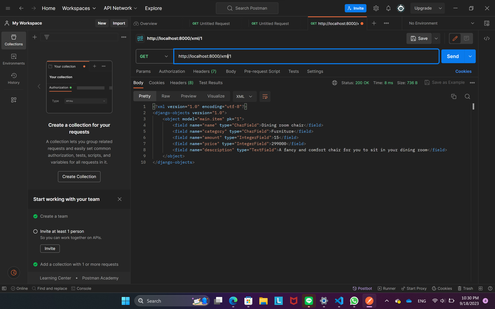

# Manage.it
> Manage.it is a web application for shops to manage their sellings, records every transaction, look up shop's statistics and many more. This app is built with django

> You can access the app on [https://manage-it.adaptable.app/main/](https://manage-it.adaptable.app/main/)

### Documentation:
- **[Tugas 2](#tugas-2)**<br>
- **[Tugas 3](#tugas-3)**<br>
- **[Tugas 4](#tugas-4)**<br>
- **[Tugas 5](#tugas-5)**<br>

***
# Tugas 2
# This is how I make it 👇

## Membuat proyek Django baru
### Step 1: Buat direktori baru dan aktifkan _Virtual environment_
1. Buat direktori baru dengan nama `inventory_management`.
2. Buka direktori pada _command prompt_ kemudian jalankan perintah berikut.
```
python -m venv env
```
3. Aktifkan *Virtual Environment* dengan perintah berikut.
```
env\Scripts\activate.bat
```

### Step 2: _Install_ semua dependencies yang dibutuhkan dan buat proyek Django baru
1. Buat sebuah file bernama `requirements.txt` yang berisi:
```
django
gunicorn
whitenoise
psycopg2-binary
requests
urllib3
```
2. _Install_ semua dependencies di dalam _virtual environment_ dengan menjalankan perintah `pip install -r requirements.txt`. 
3. Setelah itu, buat proyek Django baru menggunakan perintah `django-admin startproject inventory-management .`

## Membuat aplikasi dengan nama main.
1. *Di dalam _virtual environment_*, jalankan perintah
`python manage.py startapp main`. Setelah itu, sebuah direktori aplikasi baru bernama `main` akan terbuat di dalam direktori utama.
2. Buka file `settings.py` pada direktori proyek, kemudian tambahkan `main` ke dalam variabel `INSTALLED_APPS` seperti berikut:
```python
INSTALLED_APPS = [
    ...
    'main',
    ...
]
```
3. Setelah itu, aplikasi main sudah berhasil terbuat dan terdaftar ke dalam proyek `inventory_management`.

## Melakukan _routing_ pada proyek.
1. Buka file `urls.py` pada direktori proyek `inventory_management`.
2. Pada variable `urlpatterns`, tambahkan kode berikut.
```python
from django.contrib import admin
from django.urls import path,include

urlpatterns = [
    ...,
    path('main/', include('main.urls')),
    ...
]
```

## Membuat model pada aplikasi `main` dengan nama `Item`
1. Buka file `models.py` kemudian buat objek model dengan mendefinisikan atribut-atribut yang ingin kita gunakan seperti sebagai berikut.
```python
from django.db import models

class Item(models.Model):
    name= models.CharField(max_length=256)
    category = models.CharField(max_length=50)
    amount = models.IntegerField()
    price = models.IntegerField()
    description = models.TextField()
```

2. Buat dan aplikasikan migrasi pada model dengan menjalankan perintah berikut.
* Buat migrasi model
```
python manage.py makemigrations
```
> perintah ini berfungsi untuk membuat berkas migrasi yang berisi perubahan pada model yang telah kita buat.

* Aplikasikan migrasi ke basis data.
```
python manage.py migrate
```
> perintah ini berfungsi untuk mengaplikasikan perubahan pada berkas migrasi ke basis data.

Dengan menjalankan langkah-langkah ini, kita telah berhasil membuat model pada aplikasi `main` dengan nama `Item`.

##  Membuat dan menghubungkan fungsi pada `views.py` dengan template.
1. Buat fungsi `show_main` pada `views.py` untuk mengimplementasikan template yang ingin dirender, definisikan juga variabel-variabel yang dibutuhkan di dalam template di dalam variable `context` seperti kode berikut.
```python
from django.shortcuts import render

context = {
    'nama' : 'Fathan Naufal Adhitama',
    'kelas' : 'PBP E'
}

def show_main(request):
    return render(request, "main.html", context)
```

2. Di dalam direktori `main`, buat direktori baru bernama `templates` kemudian buat file `main.html` di dalamnya. Pada file `main.html`, modifikasi tampilan pada template dengan menggunakan variable-variable yang di-_passing_ dari `views`.
```html
<h1>Manage.it</h1>

<h5>Name: </h5>
<p>{{nama}}</p>
<h5>Class: </h5>
<p>{{kelas}}</p>
```

> Dengan melakukan langkah ini, views telah terhubung dengan template dan siap untuk dirender menggunakan fungsi `show_main`.

## Membuat _routing_ pada aplikasi `main`.
1. Buat file dengan nama `urls.py` di dalam direktori `main`.
2. Setelah itu, masukkan kode berikut untuk mengatur views yang diinginkan pada tiap _path_.
```python
from django.urls import path
from main.views import show_main

app_name = 'main'

urlpatterns = [
    path('', show_main, name='show_main'),
]
```

Dengan melakukan langkah ini, fungsi `show_main` yang telah dibuat pada `views.py` dapat dipetakan ke URL yang diinginkan.

## Deployment menggunakan Adaptable
Terakhir, dilakukan deployment pada Adaptable dengan langkah-langkah berikut.
1. _Sign in_ ke Adaptable menggunakan akun Github.
2. Buat *New App* kemudian pilih opsi *Connect an existing repository*. Pilih _repository_ `inventory_management`.
3. Pilih *Python App Template* sebagai Deploy Template, dan *PostgreSQL* sebagai Database Type.
4. Ubah `Python Version` sesuai dengan versi Python yang telah terinstall pada _device_.
5. Isi `Start Command` dengan perintah berikut.
```
python manage.py migrate && gunicorn inventory_management.wsgi
```
6. Masukkan nama aplikasi, kemudian centang opsi `HTTP Listener on PORT` dan klik `Deploy App`.

***
## Bagan


***

## Mengapa menggunakan virtual environment?
- **_Virtual environment_** (lingkungan virtual) berfungsi untuk memisahkan pengaturan dan package yang diinstal pada setiap proyek Django sehingga perubahan yang dilakukan pada satu proyek tidak mempengaruhi proyek lainnya.
- Dengan memisahkan tiap proyek Django di `virtualenv`-nya masing-masing, **package** dan **dependencies** tiap proyek akan terisolasi dan tidak akan terganggu karena mengalami konflik dengan **package** dan **dependencies** dari proyek Django lain.
- Karena sifat terisolasinya tadi, `virtual environment` dapat digunakan untuk membuat environment sendiri untuk tujuan **_testing_** dan **_development_** sehingga perubahan pada satu proyek tidak akan berpengaruh pada proyek lain.
- Selain itu, `virtual environment` juga berguna untuk kepentingan dalam aspek **_Security_**, **_Version Control_**, dan **_Deployment_**.

***

## MVC, MVT, MVVM
**MVC, MVT, dan MVVM** adalah pola arsitektur yang biasa digunakan dalam pengembangan aplikasi berbasis pemrograman untuk menyusun proyek yang terorganisasi dengan baik sehingga mempermudah proses _development_ maupun _maintenance_. Secara garis besar, mereka dapat didefinisikan sebagai berikut:
1. **MVC (Model-View-Controller)**:

- Model: menghubungkan aplikasi dengan basis data dan mengatur interaksi dengan data tersebut.
- View: mengontrol bagaimana data yang dikelola oleh model akan ditampilkan kepada pengguna.
- Controller: menangani dan memproses input user, dan mengkoordinasikan **Model** dan **View**
2. **MVT (Model-View-Template)**:

   MVT adalah salah satu turunan dari struktur MVC (Model-View-Controller), perbedaannya terletak pada:
- Template: memisahkan kode HTML dari logika aplikasi, merancang tampilan yang akhirnya akan diisi dengan data dari model melalui view
3. **MVVM (Model-View-ViewModel)**:

    MVVM juga tidak berbeda jauh dengan pola arsitektur MVC dan MVT, perbedaannya terletak pada fungsinya yang memisahkan antara _business logic_ dan _data presentation logic_ (Views atau UI):
- ViewModel: mengelola presentasi data, logika tampilan, dan user input. Mengubah data dari **Model** menjadi format yang dapat ditampilkan oleh **View**

Sehingga, perbedaan utama dari ketiganya adalah MVC menggunakan Controller untuk _handle_ input user, MVT menggunakan Template untuk merancang kode HTML yang ingin ditampilkan, MVVM menggunakan ViewModel untuk memisahkan _business logic_ dan tampilan/User Interface.

***
## Bonus
Implementasi 4 _testing_ dasar pada file `tests.py` untuk menguji _response_ tampilan dari HTML agar sesuai dengan ketentuan tugas.


***

# Tugas 3

## Form `POST` dan `GET` dalam Django?
   1. **Form POST**
      Pada form dengan method `POST`, data akan dikirim melalui HTTP Request Body dan tidak dapat dilihat secara langsung melalui URL sehingga data akan lebih aman dalam proses pengirimannya.
   2. **Form `GET`**
      Sedangkan pada form dengan method `GET`, data akan dikirim melalui URL sehingga dengan mudah dilihat dan data akan lebih terekspos. Selain itu, panjang data juga terbatas sesuai dengan aturan batas panjang URL Address.

   Pada praktiknya, form dengan method `POST` biasanya digunakan untuk mengirim data yang akan berubah pada server, sedangkan form dengan method `GET` biasanya digunakan untuk mengambil data dari server (contoh: mengambil hasil pencarian dari server.)

## Perbedaan utama XML, JSON, dan HTML dalam konteks pengiriman data?
   1. **XML**
      Tidak didesain untuk men-*display* data, melainkan untuk membawa dan mengirim data yang bersifat _human-readable_ dan _machine-readable_. XML tidak mendukung array, tetapi mendukung tipe data **_namespace_**
   2. **JSON**
      Format data ringkas yang terdiri dari _key and value pairs_. _Syntax_ dari JSON mirip dengan objek dalam javascript. Secara ukuran, JSON lebih ringan dibanding XML. JSON tidak mendukung tipe data **_namespace_**, tetapi mendukung array.
   3. **HTML**
      _Markup Language_ yang didesain khusus untuk menampilkan konten web, bukan untuk pengiriman data antaraplikasi/server.

## Mengapa JSON sering digunakan dalam pertukaran data antara aplikasi web modern?
   JSON lebih sering dipilih sebagai format untuk pertukaran data antara aplikasi web modern karena keunggulan-keunggulannya dibanding format lain, yaitu sebagai berikut:
   - **Keringanan data**
     Seperti yang sudah dijelaskan pada poin sebelumnya, JSON memiliki ukuran yang lebih ringan dibanding dengan XML sehingga dapat meningkatkan kecepatan dan efisiensi data transfer.
   -  **_Human-readability_**
     Dengan format _key and value pairs_, data lebih mudah dibaca dan dipahami oleh manusia.
   -  **Dukungan yang luas**
     Hampir semua bahasa pemrograman modern telah mendukung _parsing_ dan _serializing_ format data JSON. Sehingga format JSON dapat digunakan untuk berkomunikasi dengan banyak teknologin dan bahasa pemrograman yang berbeda.
   - **Kecocokan dengan RESTful API**
     Format JSON cocok dengan _REST architectural style_ yang populer di kalangan pengembangan web modern.

## Implementasi Checklist
   ### Membuat input form untuk menambahkan objek Item
   1. Membuat file `forms.py`untuk membuat _forms_ sesuai model `Item` menggunakan Django `ModelForm`
   2. Membuat function `create_item` untuk mengatur implementasi _forms_ yang sudah dibuat tadi.
   3. Mengonfigurasi url pada file `urls.py` untuk mengakses function `create_item`.
   4. Membuat tampilan forms dalam file `create_item.html`.

   ### 5 fungsi views untuk melihat objek dalam format XML, JSON, HTML.
   1. Dalam file `views.py`, tambahkan import berikut
   ```python
    from django.http import HttpResponse
    from django.core import serializers
   ```

   2. Untuk mengembalikan semua objek yang ada, tambahkan fungsi untuk mengambil semua objek dari `Item` dan mengembalikannya dalam format yang diinginkan menggunakan `HttpResponse` dan `serializers`. <br>
       - JSON
          ```python
          def show_json(request):
             data = Item.objects.all()
             return HttpResponse(serializers.serialize("json", data), content_type="application/json")
          ```

       - XML
          ```python
          def show_xml(request):
             data = Item.objects.all()
             return HttpResponse(serializers.serialize("xml", data), content_type="application/xml")
          ```

       - HTML
          ```python
          def show_main(request):
             items = Item.objects.all()

             context = {
                 'nama': 'Fathan Naufal Adhitama',
                 'kelas': 'PBP E',
                 'items': items
             }
             return render(request, "main.html", context)
          ```

   3. Untuk menampilkan objek sesuai ID, tambahkan fungsi untuk mengambil objek-objek `Item` yang telah difilter berdasarkan input ID yang akan didapatkan dari URL kemudian dikembalikan dalam bentuk `HttpResponse` setelah diserialisasi menjadi format yang diinginkan menggunakan `serializers`.
       - XML
          ```python 
          def show_xml_by_id(request, id):
             data = Item.objects.filter(pk=id)
             return HttpResponse(serializers.serialize("xml", data), content_type="application/xml")
          ```

       - JSON
          ```python 
          def show_json_by_id(request, id):
             data = Item.objects.filter(pk=id)
             return HttpResponse(serializers.serialize("json", data), content_type="application/json")
          ```

## Membuat routing URL
   1. Pada file `urls.py`, import semua function yang sudah dibuat pada poin sebelumnya.
   ```python
   from main.views import show_main, create_item, show_json,show_xml, show_json_by_id, show_xml_by_id
   ``` 
   2. Kemudian, tambahkan _path_ untuk mengakses masing-masing fungsi.
   ```python
   ...,
    path('', show_main,name='show_main'),
    path('json/', show_json, name="show_json"),
    path('xml/', show_xml, name="show_xml"),
   ...
   ``` 
   Untuk function yang membutuhkan ID dari URL, path ditambahkan seperti berikut:
   ```python
   ...,
    path('xml/<int:id>/', show_xml_by_id, name='show_xml_by_id'),
    path('json/<int:id>/', show_json_by_id, name='show_json_by_id'),
   ...
   ``` 
   > `path` dengan format di atas dapat diakses dengan memasukkan format URL seperti: `http://localhost:8000/xml/[id]`

## Akses URL menggunakan POSTMAN
1. XML

2. JSON

3. HTML

4. XML by ID

5. JSON by ID


***

# Tugas 4

##  UserCreationForm

`UserCreationForm` adalah _built-in form_ yang diimpor dari `django.contrib.auth.forms`, berfungsi untuk membantu kita membuat formulir pendaftaran `User` di Web yang kita buat. Dengan bantuan `UserCreationForm`, kita tidak perlu menulis kode tambahan lagi untuk melakukan pendaftaran `User` baru di web seperti validasi password.
- **Kelebihan** dari `UserCreationForm` ini di antaranya adalah :
   1. Mempermudah pendaftaran user baru
   2. Validasi input yang sesuai
   3. Terintegrasi dengan object `User`
   4. Relatif mudah untuk digunakan.
- **Kekurangan**nya adalah:
   1. Memiliki tampilan standar
   2. Fungsi fitur yang terbatas
   3. _Error message customization_

## Authentication & Authorization
Perbedaan utama antara **otentikasi** dan **otorisasi** di Django adalah:
- **Otentikasi (_Authentication_)** bertujuan untuk melakukan verifikasi identitas user. Metode yang biasanya dilakukan adalah melalui username, password, atau email.
- Sementara **Otorisasi (_Authorization_)** bertujuan untuk menentukan kewenangan/akses apa saja yang bisa dilakukan oleh user yang telah ter-otentikasi. Misalnya, user dengan kategori `mahasiswa` hanya bisa melihat nilai, sedangkan user dengan kategori `dosen` dapat meng-_upload_ dan mengubah nilai. Tahap **otorisasi** ini bisa dilakukan setelah proses **otentikasi** selesai dilakukan

Kedua tahap ini merupakan faktor yang penting dalam sebuah aplikasi karena keduanya sangat krusial dalam hal keamanan pada sebuah aplikasi agar tidak sembarangan orang dapat mengakses data terutama yang bersifat sensitif.

## Apa itu _Cookies_?
Cookies adalah tempat penyimpanan kecil yang disimpan di browser pengguna dan digunakan untuk menyimpan informasi yang dapat diakses oleh server di halaman web tersebut. Cookies biasanya digunakan untuk: Authentication, User tracking, and Maintaining user preferences

Untuk mengelola data di _client-side_, Django menggunakan cookies untuk melakukan proses _authentication & authorization_ yang bernama **cookie-based user sessions**. Hal ini dilakukan dengan menyimpan _Session ID_ di dalam cookies untuk dapat melakukan _holding state_ pada HTTP yang _stateless_.

## Apakah _Cookies_ aman?
Secara default, _cookies_ berfungsi untuk menyimpan informasi di dalam browser dan aman untuk digunakan dalam _web development_. Akan tetapi, tentu saja ada risiko potensial yang dapat terjadi apabila tidak berhati-hati dalam penggunaan _cookies_. Contohnya adalah **_Cookies Poisoning_** yang bertujuan untuk mengubah data pada _cookies_ dan mendapatkan akses ke dalam website. 

## Implementasi Checklist
### Implementasi fungsi register, login, logout
#### Register
1. Membuat fungsi dan form untuk register dengan menggunakan `UserCreationForm` yang diimpor dari `django.contrib.auth.forms` pada `views.py`.
2. Membuat file HTML `register.html` sebagai template halaman register user.
3. Tambahkan path URL untuk halaman register ke dalam `urls.py`
#### Login
1. Membuat fungsi dan form untuk login dengan mengimpor `authenticate` dan `login`.
```python
from django.contrib.auth import authenticate, login
```
2. Membuat file HTML `login.html` sebagai template halaman login user.
3. Tambahkan path URL untuk halaman login ke dalam `urls.py`
#### Logout
1. Membuat fungsi dan form untuk logout dengan mengimpor `logout`. Fungsi ini berfungsi untuk membawa user kembali ke halaman login.
```python
from django.contrib.auth import logout
```
2. Tambahkan path URL untuk halaman logout ke dalam `urls.py`
#### Restriksi Halaman Main
1. Pada `views.py`, import `login_required`
```python
from django.contrib.auth.decorators import login_required
```
2. Setelah itu, tambahkan _decorator_ pada fungsi `show_main` agar halaman Main hanya dapat diakses oleh user yang sudah login (terautentikasi).
```python
...
@login_required(login_url='/login')
def show_main(request):
...
```

### Membuat akun dan input dummy data
1. Masuk ke halaman `http://localhost:8000/register`, kemudian daftarkan username dan password sesuai dengan syarat yang ditentukan.
2. Login menggunakan akun yang sudah didaftarkan.
3. Setelah berhasil login, klik _button_ **Add New Item** dan isi form dengan data yang ingin diinput. Kemudian klik **Add Item**.
4. Ulangi langkah-langkah tersebut untuk akun dummy yang lain.

### Menghubungkan model Item dengan User
1. Pada `models.py`, _import_ model `User`.
```python
from django.contrib.auth.models import User
```
2. Pada model `Item`, tambahkan atribut berikut untuk menghubungkan satu produk dengan satu user melalui sebuah relationship, dimana sebuah item pasti terasosiasikan dengan seorang user.
```python
class Item(models.Model):
    user = models.ForeignKey(User, on_delete=models.CASCADE)
    ...
```
3. Pada file `views.py`, modifikasi fungsi `create_item` menjadi sebagai berikut
```python
def create_item(request):
 form = ItemForm(request.POST or None)

 if form.is_valid() and request.method == "POST":
     item = form.save(commit=False)
     item.user = request.user
     item.save()
     return HttpResponseRedirect(reverse('main:show_main'))
 ...
```
4. Ubah juga fungsi `show_main` menjadi sebagai berikut.
```python
def show_main(request):
    items = Item.objects.filter(user=request.user)

    context = {
        'name': request.user.username,
    ...
```
5. Setelah itu, lakukan migrasi untuk menyimpan semua perubahan pada model.

### Tampilan detail informasi user dan penerapan cookies
1. Untuk menampilkan detail informasi pengguna yang sedang logged in seperti username, ubah fungsi `show_main` menjadi seperti berikut.
```python
def show_main(request):
    items = Item.objects.filter(user=request.user)

    context = {
        'name': request.user.username,
    ...
```
2. Implementasi cookies yang dilakukan adalah dengan menampilkan informasi last login yang disimpan pada cookies.
3. Pada `views.py`, import `datetime`
4. Kemudian, pada fungsi `login_user`, tambahkan _cookie_ yang bernama `last_login` dengan cara menambahkan bagian kode berikut.
```python
...
if user is not None:
    login(request, user)
    response = HttpResponseRedirect(reverse("main:show_main")) 
    response.set_cookie('last_login', str(datetime.datetime.now()))
    return response
...
```
5. Ubah juga fungsi `logout_user` menjadi berikut untuk menghapus _cookie_ ketika user telah logout.
```python
def logout_user(request):
    logout(request)
    response = HttpResponseRedirect(reverse('main:login'))
    response.delete_cookie('last_login')
    return response
```
6. Setelah itu, tambahkan informasi cookies ke dalam variabel `context` pada fungsi `show_main`.
```python
context = {
    'name': 'Pak Bepe',
    'class': 'PBP A',
    'products': products,
    'last_login': request.COOKIES['last_login'],
}
```
7. Tambahkan bagian berikut pada `main.html` untuk menampilkan informasi `last_login` yang ada pada variable `context`.
```python
...
<h5>Sesi terakhir login: {{ last_login }}</h5>
...
```

***

# Tugas 5

## Element selector
**_Element selector_** adalah salah satu jenis _selector_ yang digunakan untuk memilih semua elemen HTML berdasarkan jenis elemennya atau HTML tag-nya. **_Element selector_** tepat digunakan pada CSS ketika kita ingin menerapkan suatu _styling_ terhadap semua elemen HTML dengan jenis/tag tertentu.
Misal:

```CSS
   p{
      color: black;
   }
```

Kode di atas berfungsi untuk mengubah warna teks menjadi hitam pada semua elemen `<p>`.

## HTML5 Tags
- `<h1>` : untuk menulis Heading/Judul dengan tingkat yang paling tinggi.
- `<p>` : untuk membuat teks dalam bentuk paragraf.
- `<a>` : untuk menambahkan **_link_** ke halaman web lain, file, atau lokasi di halaman web yang sama.
- `` : untuk menampilkan gambar.
- `<button>` : untuk membuat tombol interaktif dengan fungsi yang dapat dikustomisasi.
- `<form>` : untuk membuat formulir.
- `<input>`: menambahkan elemen input ke dalam formulir.
- `<table>` : membuat tabel
- `<ul>` : membuat list yang tidak memiliki urutan (**_unordered list_**)
- `<ol>` : membuat list yang memiliki urutan (**_ordered list_**)
- `<li>` : untuk menambahkan item pada list
- `<body>` : Berisi konten utama dokumen.

## Margin dan padding
1. **Margin**
- Margin adalah ruang di sekitar elemen HTML yang terletak di luar batas elemen tersebut.
- Margin berfungsi untuk mengatur jarak suatu elemen dengan elemen lain dalam suatu _container_ yang lebih besar.
- Margin tidak memiliki latar belakang atau warna.

2. __Padding__
- Padding adalah ruang di sekitar konten elemen HTML di dalam batas elemen tersebut.
- Padding berfungsi untuk mengatur jarak antara batas/_border_ elemen HTML dengan konten di dalamnya.
- Padding memiliki warna yang sesuai dengan elemen.

## Tailwind dan Bootstrap 

| Perbedaan | Tailwind | Bootstrap |
|--|--|--|
| Pendekatan design | **_Utility-based_**, tidak menyediakan komponen siap pakai | **_Component-based_**, menyediakan komponen siap pakai dengan desain yang sudah diberikan secara default |
| Kustomisasi | Lebih fleksibel karena tidak terdapat tema bawaan | Menggunakan tema bawaan, sehingga kustomisasinya terbatas jika ingin menggunakan desain yang berbeda dengan tema bawaan Bootstrap |
| Ukuran file | Dirancang untuk lebih ringan, namun ukuran file juga dapat meningkat ketika class utility yang digunakan juga semakin banyak | Lebih besar dalam hal ukuran file karena menyediakan banyak fitur dan komponen yang siap pakai |
| Kesulitan penggunaan | Tailwind memerlukan pengetahuan tentang basic CSS untuk memahami penggunaan _class-utility_ yang disediakan | Bootstrap lebih mudah untuk digunakan oleh pemula karena menyediakan komponen siap pakai |

Bootstrap lebih baik digunakan untuk proyek yang membutuhkan pengembangan yang cepat dengan komponen siap pakai.
Tailwind cocok digunakan untuk proyek yang membutuhkan kontrol desain yang lebih besar dan fleksibel dalam mengatur tampilan elemen.

## Implementasi checklist

1. Instalasi CSS Framework
Pada proyek ini, saya menggunakan CSS Framework Tailwind sehingga saya perlu menginstall `django-tailwind`.
2. Kustomisasi halaman login, register, dan add inventory dengan menerapkan CSS pada form yang terdapat dalam halaman tersebut.
3. Kustomisasi halaman daftar inventori dengan menambahkan `Card` untuk menampilkan setiap item yang disimpan

## Bonus
Menggunakan **_pseudo-class_** `:last-child` untuk melakukan select terhadap kelas `.cards` terakhir kemudian menambahkan `background-color` yang berbeda.
